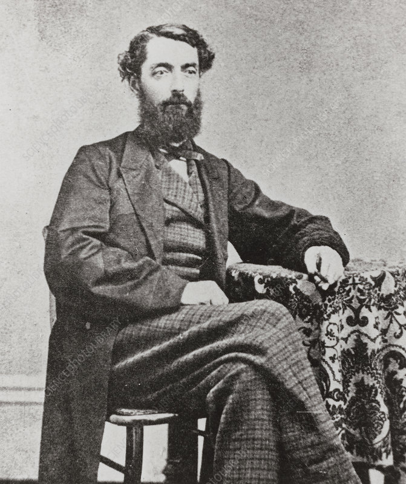

# History of Natural Gas
Naturally occurring natural gas was discovered and identified in America as early as 1626,
when French explorers discovered natives igniting gases that were seeping into and around
Lake Erie. The American natural gas industry got its beginnings in this area. In 1859,
Colonel Edwin Drake (a former railroad conductor who adopted the title 'Colonel' to
impress the townspeople) dug the first well. 

Most in the industry characterize this well as the beginning of the natural gas
industry in America. A two-inch diameter pipeline was built, running 5 and ½ miles from
the well to the village of Titusville, Pennsylvania. The construction of this pipeline proved
that natural gas could be brought safely and relatively easy from its underground source to
be used for practical purposes.
In 1821, the first well specifically intended to obtain natural gas was dug in Fredonia, New
York, by William Hart. After noticing gas bubbles rising to the surface of a creek, Hart dug a
27 foot well to try and obtain a larger flow of gas to the surface. Hart is regarded by many as
the 'father of natural gas' in America. Expanding on Hart's work, the Fredonia Gas Light
Company was eventually formed, becoming the first American natural gas company.
In 1885, Robert Bunsen invented what is now known as the Bunsen burner. He
managed to create a device that mixed natural gas with air in the right proportions, creating
a flame that could be safely used for cooking and heating. The invention of the Bunsen
burner opened up new opportunities for the use of natural gas in America, and throughout the world. The invention of temperature-regulating thermostatic devices allowed for better
use of the heating potential of natural gas, allowing the temperature of the flame to be
adjusted and monitored. 
Without any way to transport it effectively, natural gas discovered pre-world war II was
usually just allowed to vent into the atmosphere, or burnt, when found alongside coal and
oil, or simply left in the ground when found alone.
One of the first lengthy pipelines was constructed in 1891. This pipeline was 120 miles long,
and carried natural gas from wells in central Indiana to the city of Chicago. However, this
early pipeline was very rudimentary, and did not transport natural gas efficiently. It wasn't
until the 1920's that any significant effort was put into building a pipeline infrastructure.
After World War II welding techniques, pipe rolling, and metallurgical advances allowed
for the construction of reliable pipelines. This led to a post-war pipeline construction boom
lasting well into the 60's, creating thousands of miles of pipeline in America.
Once the transportation of natural gas was possible, new uses for natural gas were
discovered. These included using natural gas to heat homes and operate appliances such as
water heaters and oven ranges. Industry began to use natural gas in manufacturing and
processing plants. Also, natural gas was used to heat boilers used to generate electricity. The
transportation infrastructure made natural gas easier to obtain, and as a result expanded its
uses. 

